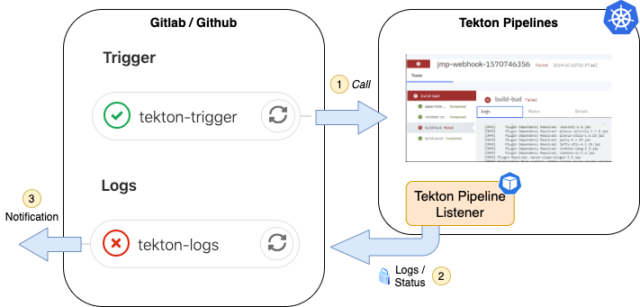
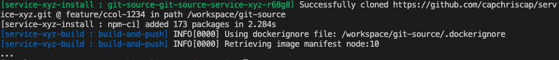

# Tekton Pipeline Listener

Tekton pipelines have currently the following main challenges: 

- Git Systems (Gitlab, Github) are not connected to Tekton
- No support for notifications yet within Tekton

**Solution:** Secure web service that allow other external systems (Gitlab, Github, ...) to access Tekton Pipeline states and logs.



## Getting started

Run locally

```bash
go run main.go
```

or via docker

```bash
docker run -p 8080:8080 capchriscap/tekton-pipeline-listener
```

## Example

```yaml
# gitlab-ci.yml
stages:
  - trigger
  - logs

# use EVENT_ID to identity pipeline run
before_script:
  - export EVENT_ID=$(cat /dev/urandom | tr -dc 'a-z0-9' | fold -w 10 | head -n 1)

variables:
  EVENT_ID: tnxhf-r-6k7wv
  SERVICE: service-xyz
  LISTENER_HOST: https://tekton-listener.example.com
  TRIGGER_HOST: https://ci.example.com

tekton-trigger:
  image: alpine/curl
  stage: trigger
  variables:
    AUTH:  "X-Gitlab-Token: ${TEKTON_WEBHOOK_TOKEN}"
  script:
  - PAYLOAD="{\"event_id\": $EVENT_ID}"
  # trigger CI pipeline in tekton
  - curl --header "${AUTH}" --data "$PAYLOAD" $TRIGGER_HOST

tekton-logs:
  image: alpine/curl
  stage: logs
  script:
  - export PIPELINE_RUN="$SERVICE-run-$EVENT_ID"
  # stream logs of all tasks
  - curl --user ${TEKTON_LISTENER_CREDS} -N $HOST/logs/$PIPELINE_RUN
  # get final state
  - curl --user ${TEKTON_LISTENER_CREDS} -f $HOST/status/$PIPELINE_RUN
```

so that this configuration work, ensure that you have the Tekton pipeline run name defined as `$SERVICE-run-$EVENT_ID`: 

```yaml
# tekton-triggers.yaml
apiVersion: tekton.dev/v1alpha1
kind: TriggerTemplate
metadata:
  name: ci-pipeline-template
spec:
  params:
    - name: eventid
    - name: servicename
  resourcetemplates:
  - apiVersion: tekton.dev/v1alpha1
    kind: PipelineRun
    metadata:
      name: $(params.servicename)-run-$(params.eventid)
    spec:
      params:
      - name: eventid
        value: $(params.eventid)
  # ...
---
apiVersion: tekton.dev/v1alpha1
kind: TriggerBinding
metadata:
  name: ci-pipelinebinding
spec:
  params:
    - name: eventid
      value: $(body.event_id)
  # ...
```


## Endpoints

### /health

Used for checking whether service is running and healthy

Example: 

```bash
curl localhost:8080/health
```

### /logs/:pipelineRunId

Access logs of pipeline run

> Endpoint is secured via Basic Authentication

Example: 

```bash
$ curl -N --user admin:admin localhost/logs/service-xyz-run-r68g8
```

with output



### /status/:pipelineRunId

Provide final pipeline run status to check whether pipeline was successful or not

> Endpoint is secured via Basic Authentication

Example: 

```bash
$ curl --user admin:admin localhost/status/service-xyz-run-r68g8
{"message":"All Tasks have completed executing","reason":"Succeeded","type":"Succeeded","status":"True"}
```

## Contributions

Pull requests and issues are always welcome! :-) 

## License

MIT